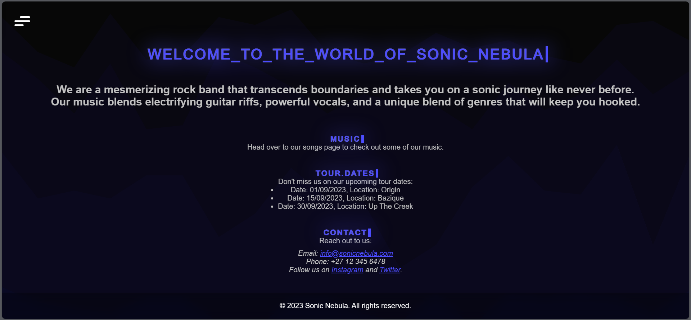
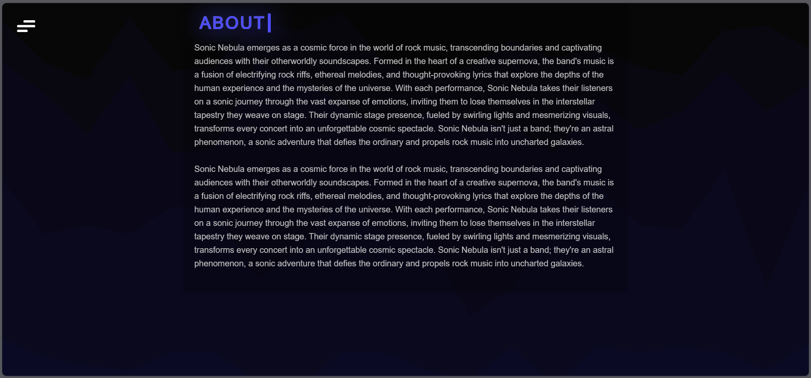
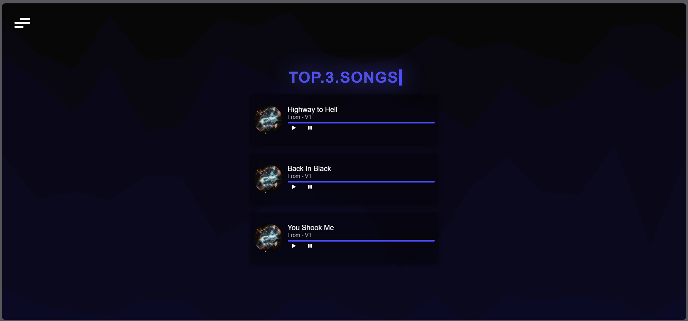
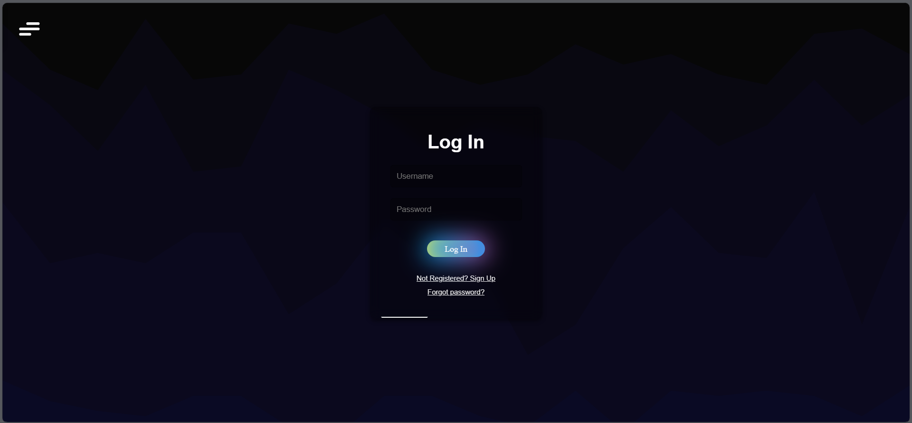
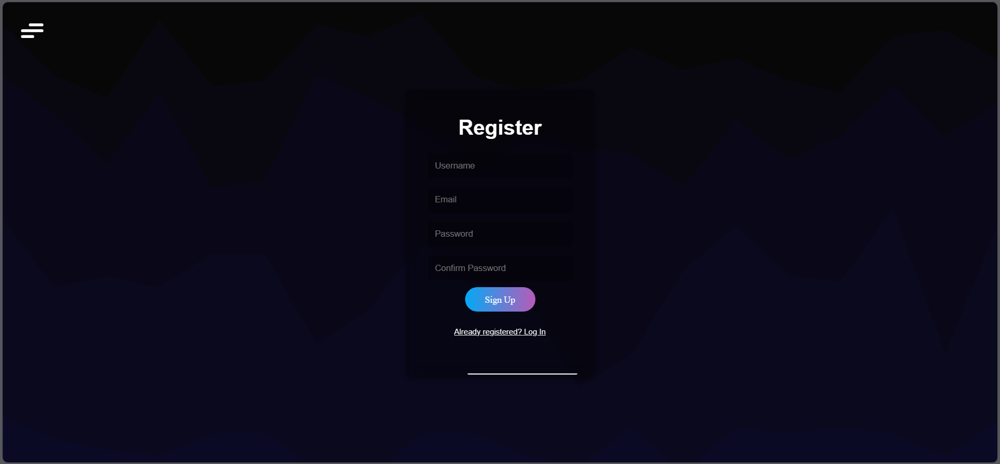

# FictionalBandWebPage

## Project Description

FictionalBandWebPage is a web application created to showcase a fictional rock band called "Sonic Nebula." This project serves as a platform for fans and music enthusiasts to explore information about the band, listen to their songs, and interact with the community. It provides the following key features:

- **User Authentication:** Users can create accounts, log in.
- **Home Page:** An introduction to the band and its latest news.
- **About Page:** Detailed information about the band's history.
- **Songs Page:** A collection of songs from Sonic Nebula's discography, allowing users to listen to their tracks.

## Table of Contents

1. [Installation](#installation)
2. [Usage](#usage)
3. [Docker](#docker)

## Installation

To run FictionalBandWebPage locally, follow these steps:

1. **Clone the Repository:** Start by cloning this repository to your local machine using the following command:

git clone https://github.com/marnoshepherd/fictionalbandwebpage.git

2. **Navigate to the Project Folder:** Change your current directory to the project folder:

cd fictionalbandwebpage

3. **Install Dependencies:** Install the required dependencies using npm (Node Package Manager):

npm install

4. **Database Setup:** Set up the database to store songs and user data. Make sure to configure the database connection settings in the appropriate configuration file.

5. **Start the Application:** Run the application using the following command:

npm start

6. **Access the Web App:** Open a web browser and go to `http://localhost:8000` to access the Sonic Nebula band webpage.

## Usage

Once you have the application up and running, you can explore its various features:

- **Registration and Login:** Create a new user account or log in.

- **Home Page:** Visit the home page to read the latest news and updates about Sonic Nebula.

- **About Page:** Learn more about the band's history.

- **Songs Page:** Browse the band's discography, select a song, and listen to it directly on the website.

### Screenshots

*Home Page showcasing the latest news.*

*About Page with detailed information about the band.*

*Songs Page displaying the band's songs for listening.*

*Log In Page allowing user to log in if they have already registered, or to register if they've not yet done so. Or to reset their password if they have forgotten it.*

*Register Page allowing user to register or if they have already registered, to Log In.*

## Docker

This project is also available as a Docker image. You can pull the Docker image using the following command:

docker pull marnoshepherd/fictionalbandwebpage

To run the project in a Docker container, use the following command:

docker run -p 8080:8000 marnoshepherd/fictionalbandwebpage